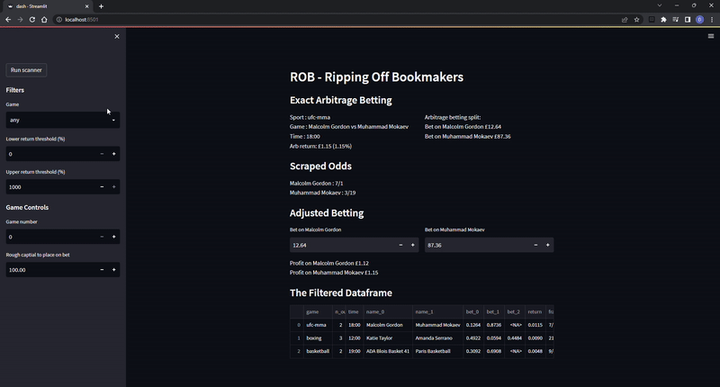

# oddschecker_scraper

**TL;DR**: This repo scans [oddschecker](https://www.oddschecker.com/) for arbitrage betting opportunities. The opportunities can be visualised in the dashboard. A description of the code can be found in my medium article (link to follow once published!).

## How to use:
1. Open the `main.py` file and configure to the games you want (already pre-configured with a few). Adjust the dictionary with the url-ending for the game webpage and the number of outcomes. E.g., for https://www.oddschecker.com/tennis, you'd place another entry in the dictionary with `{'tennis': 2}`. 
2. You can run using the `main.py` script, this will produce a csv file with the arbitrage betting opportunities in the root directory called `current_opportunities.csv`
3. You can run the dashboard by opening a command-line prompt in the directory, and typing `streamlit run dash.py`, **NOTE**, you'll need to install streamlit for this using `pip install streamlit`.

## The dashboard
The dash allows you to:
1. Run the scanner
2. See all available opportunities for the games configured in `main.py`
3. Adjust the betting values and see the betting outcomes

